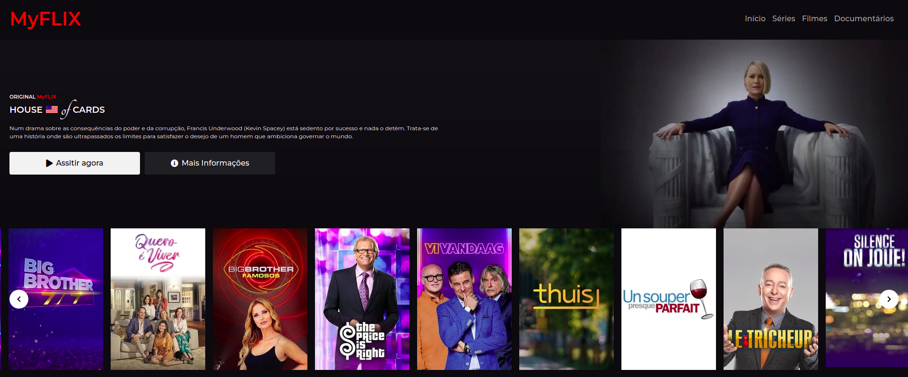

<h1 align="center">Desafio DIO - Bootcamp Front-End Inter</h1>

<h2 align="center">Página MyFlix</h2>

## Ícones para commits padrão

- :package: nova funcionalidade
- :up: atualização
- :beetle: correção de bug
- :checkered_flag: release    

